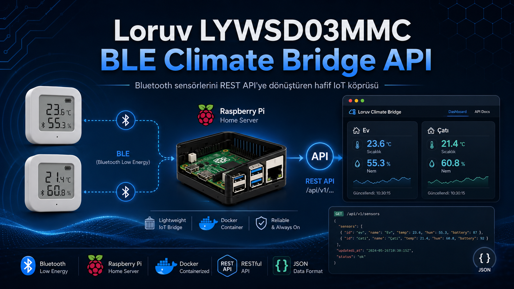
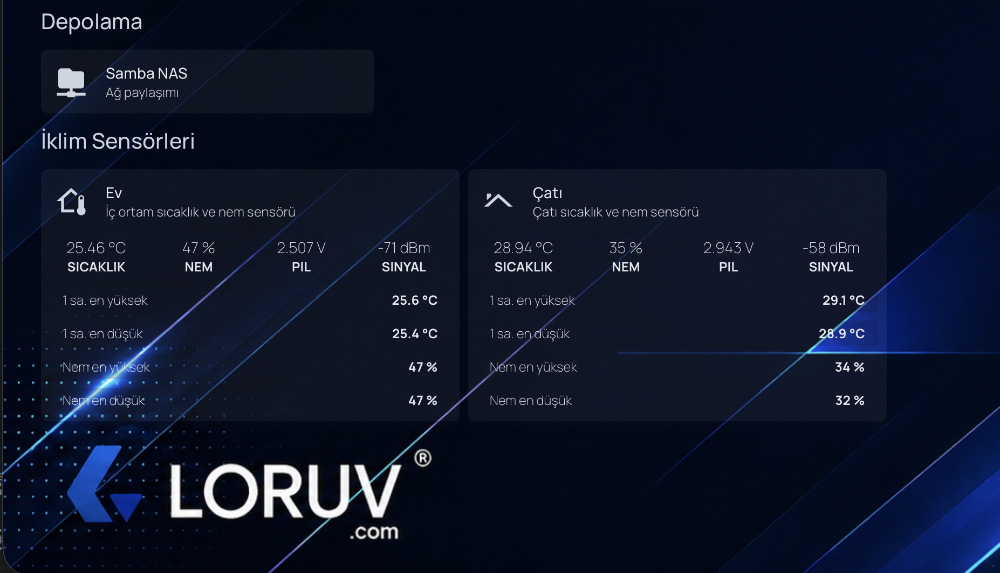
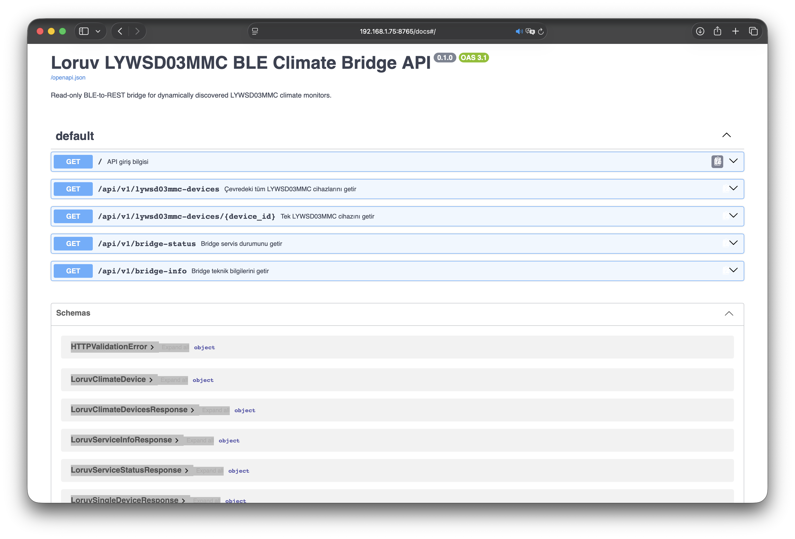
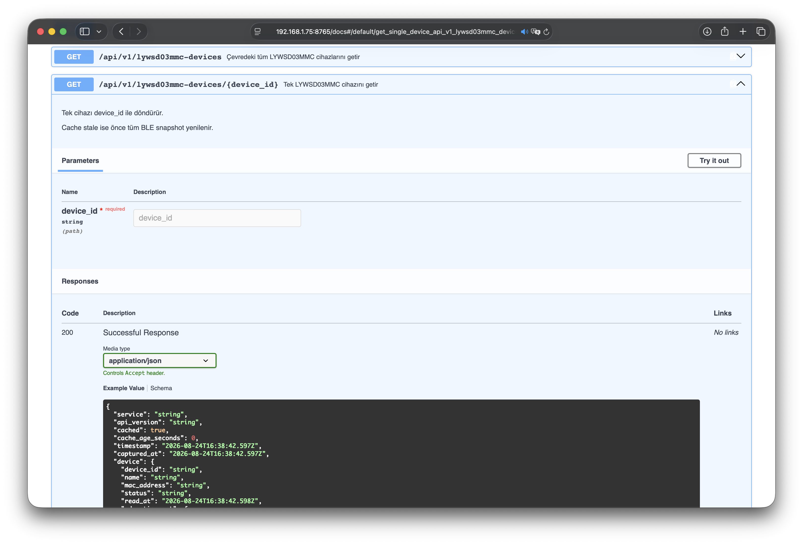
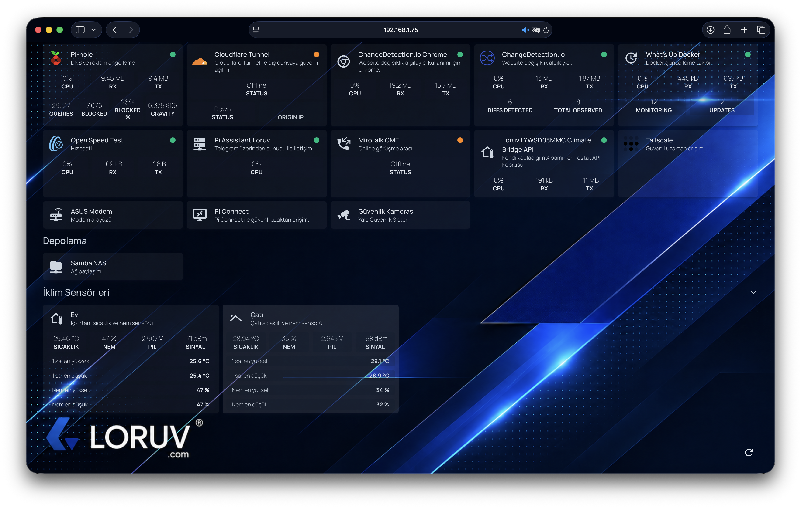
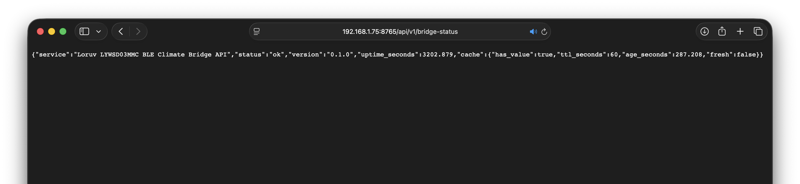
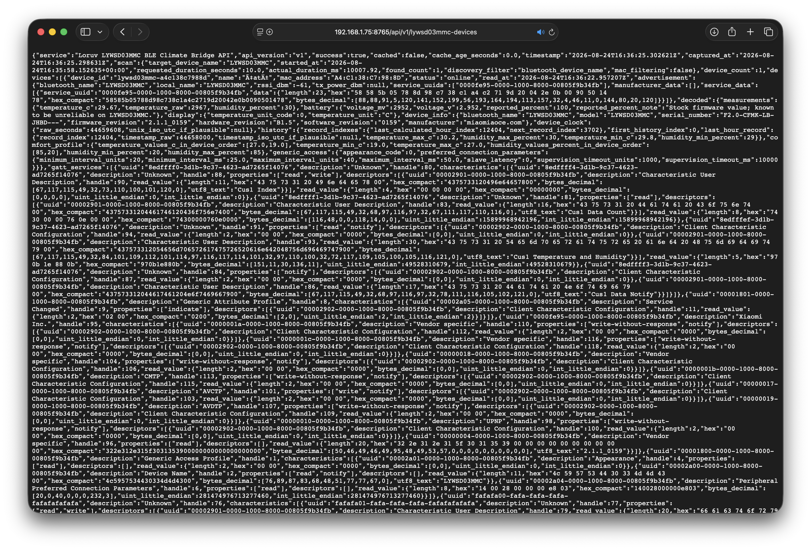
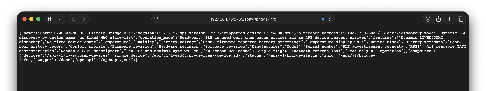

# Loruv LYWSD03MMC BLE Climate Bridge API

<p align="center"><strong>A lightweight, read-only BLE-to-REST API bridge for LYWSD03MMC temperature and humidity monitors.</strong></p>

<p align="center">Raspberry Pi • Linux • BlueZ • Docker • Portainer • FastAPI</p>

<p align="center">
  <a href="#english">🇬🇧 English</a>&nbsp;•&nbsp;<a href="#turkce">🇹🇷 Türkçe</a>&nbsp;•&nbsp;<a href="https://emrecb.com/blog/sunucu/lywsd03mmc-ble-climate-bridge-api-raspberry-pi-iot-projesi/">🔗 Blog</a>
</p>

---






---

<a id="english"></a>

# 🇬🇧 English

## Overview

**Loruv LYWSD03MMC BLE Climate Bridge API** is a lightweight REST API service designed to discover and read nearby **LYWSD03MMC Bluetooth Low Energy temperature and humidity monitors**.

The project acts as a bridge between BLE climate sensors and applications that can consume HTTP/JSON data.

It is especially suitable for:

- Raspberry Pi home servers

- Docker environments

- Portainer

- Homepage dashboards

- Custom websites

- Monitoring scripts

- Automation systems

- Lightweight IoT integrations

The service does **not** require Home Assistant, MQTT or a database.

Its primary design goal is simple:

```text

LYWSD03MMC devices

        │

        │ Bluetooth Low Energy

        ▼

Linux / BlueZ

        │

        ▼

Loruv BLE Climate Bridge API

        │

        │ HTTP / JSON

        ▼

Homepage / Website / Scripts / Automation

```

---

## Key Features

### Automatic device discovery

The service does not depend on a hard-coded MAC address list.

Whenever a fresh BLE reading is required, it scans the nearby Bluetooth environment and automatically discovers devices matching:

```text

LYWSD03MMC

```

There is no fixed device count.

If two compatible monitors are nearby, two are returned.

If a third monitor is added later, it is discovered automatically without changing the application code.

Optional MAC address mappings are used **only for friendly display names** and never as an allow-list.

---

### On-demand Bluetooth operation

The service does not continuously poll the sensors.

Bluetooth discovery and GATT connections are performed only when:

1. A device API endpoint is requested.

2. The existing RAM cache has expired.

When a fresh cache entry exists, requests are served directly from RAM without performing a BLE scan or connecting to a sensor.

This keeps unnecessary Bluetooth activity to a minimum.

---

### In-memory TTL cache

The default cache lifetime is:

```text

60 seconds

```

Example:

```text

18:00:00 → API request

           BLE scan + sensor reads

           New cache created

18:00:10 → API request

           Returned from RAM cache

           No BLE activity

18:00:40 → API request

           Returned from RAM cache

           No BLE activity

18:01:05 → API request

           Cache expired

           New BLE scan + sensor reads

```

The cache is stored only in memory.

No database or persistent cache service is required.

---

### Concurrent request protection

The project uses an asynchronous single-flight lock.

If several clients request fresh data at exactly the same time:

```text

Request 1 ─┐

Request 2 ─┤

Request 3 ─┤

Request 4 ─┘

            │

            ▼

       Single BLE refresh

            │

            ▼

       Shared RAM cache

```

Only one Bluetooth refresh operation is performed.

Other requests wait for that refresh and reuse its result.

For this reason the production container intentionally runs with:

```text

1 Uvicorn worker

```

---

## Read-only design

The bridge is intentionally designed to operate as a **read-only BLE client**.

The application does not intentionally perform GATT write operations.

This means it does not:

- Change temperature units

- Change comfort limits

- Modify device time

- Modify configuration

- Flash firmware

- Install custom firmware

- Modify history indexes

- Write values to the device

The goal is to collect available information while changing as little as possible on the monitor.

Some LYWSD03MMC functionality requires GATT write operations before data can be obtained. Those functions are intentionally excluded from the read-only design.

---

## Data collected

The API attempts to return as much directly readable information as the device exposes.

### Climate measurements

Where available:

- Temperature

- Relative humidity

- Raw temperature value

Example:

```json

{

  "temperature_c": 26.1,

  "temperature_raw": 2610,

  "humidity_percent": 45

}

```

---

### Battery information

Where available:

- Battery voltage in millivolts

- Battery voltage in volts

- Battery percentage reported by stock firmware

Example:

```json

{

  "voltage_mv": 2577,

  "voltage_v": 2.577,

  "reported_percent": 100

}

```

> The percentage reported by stock LYWSD03MMC firmware may not accurately represent the real remaining battery capacity. For this reason the API exposes the battery voltage separately and identifies the percentage as `reported_percent`.

---

### Device information

Where available:

- Bluetooth device name

- Model number

- Serial number

- Firmware revision

- Hardware revision

- Software revision

- Manufacturer

Example:

```json

{

  "bluetooth_name": "LYWSD03MMC",

  "model": "LYWSD03MMC",

  "serial_number": "F2.0-CFMK-LB-JHBD---",

  "firmware_revision": "2.1.1_0159",

  "hardware_revision": "B1.5",

  "software_revision": "0159",

  "manufacturer": "miaomiaoce.com"

}

```

---

### Display information

Where readable:

- Temperature unit

- Temperature unit code

Example:

```json

{

  "temperature_unit_code": 0,

  "temperature_unit": "C"

}

```

---

### Device clock

Where readable:

- Raw device clock value

- UTC representation when the value looks like a valid Unix timestamp

---

### History metadata

The API attempts to expose directly readable history-related metadata, including:

- History record indexes

- First history index

- Last calculated hour index

- Next record index

- Directly readable last-hour record

No history index is modified because the API performs no GATT writes.

---

### Comfort profile

Where readable:

- Temperature limits

- Humidity limits

- Raw device order

- Normalized minimum/maximum values

---

### Generic Bluetooth information

Where available:

- Bluetooth appearance code

- Preferred connection interval

- Connection latency

- Supervision timeout

---

### BLE advertisement data

The API also exposes information collected during BLE discovery.

This may include:

- Bluetooth name

- Local name

- RSSI

- TX power

- Service UUIDs

- Manufacturer data

- Service data

Binary advertisement values are preserved in formats such as:

```json

{

  "length": 5,

  "hex": "32 0a 2d 11 0a",

  "hex_compact": "320a2d110a",

  "bytes_decimal": [50, 10, 45, 17, 10]

}

```

---

## Complete readable GATT dump

In addition to decoded values, the API exposes the device's GATT structure.

For every discovered service it can return:

- Service UUID

- Service description

- Handle

- Characteristics

- Characteristic UUID

- Characteristic description

- Characteristic properties

- Characteristic handle

- Readable value

- Descriptor information

- Descriptor values when readable

- Read errors when a field cannot be accessed

Binary values may include:

- HEX representation

- Compact HEX

- Decimal byte array

- UTF-8 representation when valid

- Unsigned little-endian integer

- Signed little-endian integer

Example:

```json

{

  "uuid": "ebe0ccc1-7a0a-4b0c-8a1a-6ff2997da3a6",

  "properties": [

    "read",

    "notify"

  ],

  "read_value": {

    "length": 5,

    "hex": "32 0a 2d 11 0a",

    "hex_compact": "320a2d110a",

    "bytes_decimal": [

      50,

      10,

      45,

      17,

      10

    ]

  }

}

```

This allows advanced consumers to use values that are not yet explicitly decoded by the project.

---

## Device aliases

Devices are automatically discovered.

Aliases are optional and are **not discovery filters**.

For example:

```env

DEVICE_ALIASES=AA:BB:CC:DD:EE:01=Living Room;AA:BB:CC:DD:EE:02=Roof

```

A matching device will be presented using its friendly name.

A third nearby LYWSD03MMC that is not present in `DEVICE_ALIASES` will still be discovered and returned.

Its name will automatically be generated from the Bluetooth name and MAC address.

---

## API endpoints

### API root

```http

GET /

```

Returns basic API navigation information.

---

### All discovered climate monitors

```http

GET /api/v1/lywsd03mmc-devices

```

This is the main endpoint.

If the cache is fresh, no BLE activity occurs.

If the cache is expired, the service:

1. Scans for nearby LYWSD03MMC devices.

2. Discovers all matching devices.

3. Connects to them sequentially.

4. Reads available information.

5. Disconnects from each device.

6. Creates a new RAM cache.

7. Returns the JSON response.

---

### Single device

```http

GET /api/v1/lywsd03mmc-devices/{device_id}

```

Example:

```http

GET /api/v1/lywsd03mmc-devices/lywsd03mmc-a4c13823e6da

```

---

### Bridge status

```http

GET /api/v1/bridge-status

```

Returns:

- API health

- Application version

- Uptime

- Cache state

- Cache age

- Cache TTL

This endpoint does **not** initiate Bluetooth activity.

It is also used by the Docker healthcheck.

---

### Bridge information

```http

GET /api/v1/bridge-info

```

Returns information about:

- Supported device

- API version

- Bluetooth backend

- Discovery method

- Operating mode

- Available features

- Endpoint list

No Bluetooth scan is performed.

---

### Swagger UI

```text

http://SERVER_IP:8765/docs

```

FastAPI automatically provides an interactive Swagger interface.

---

### OpenAPI schema

```text

http://SERVER_IP:8765/openapi.json

```

---

## Example API response

A simplified response may look like:

```json

{

  "service": "Loruv LYWSD03MMC BLE Climate Bridge API",

  "api_version": "v1",

  "success": true,

  "cached": false,

  "cache_age_seconds": 0,

  "timestamp": "2026-08-24T15:00:00+00:00",

  "captured_at": "2026-08-24T15:00:00+00:00",

  "scan": {

    "target_device_name": "LYWSD03MMC",

    "requested_duration_seconds": 10,

    "found_count": 2,

    "mac_filtering": false

  },

  "device_count": 2,

  "devices": [

    {

      "device_id": "lywsd03mmc-a4c13823e6da",

      "name": "Living Room",

      "mac_address": "A4:C1:38:23:E6:DA",

      "status": "online",

      "decoded": {

        "measurements": {

          "temperature_c": 26.1,

          "temperature_raw": 2610,

          "humidity_percent": 45

        },

        "battery": {

          "voltage_mv": 2577,

          "voltage_v": 2.577,

          "reported_percent": 100

        },

        "display": {

          "temperature_unit": "C"

        },

        "device_info": {

          "model": "LYWSD03MMC",

          "firmware_revision": "2.1.1_0159",

          "hardware_revision": "B1.5",

          "software_revision": "0159",

          "manufacturer": "miaomiaoce.com"

        }

      },

      "advertisement": {

        "rssi_dbm": -61

      },

      "gatt_services": [],

      "diagnostics": {

        "write_operations_performed": 0

      }

    }

  ]

}

```

The real response can contain significantly more GATT and diagnostic information.

---


# Screenshots

Screenshots are kept outside the application source so the README can stay clean while still documenting the expected user experience.

Recommended repository structure:

```text
docs/
└── screenshots/
    ├── homepage-climate-cards.png
    ├── swagger-api.png
    └── portainer-stack.png
```

Suggested screenshots:

- **Homepage climate cards** — two side-by-side sensor cards showing current temperature, humidity, battery voltage, RSSI and last-hour minimum/maximum values.
- **Swagger API** — the FastAPI `/docs` interface with the available bridge endpoints.
- **Portainer stack** — the running `loruv-lywsd03mmc-climate-bridge-api` container and its healthy status.

After adding the image files, uncomment the Markdown lines below:

<!--


-->

> Keeping the image links commented prevents broken image placeholders before screenshots are added to the repository.

---

# Requirements

## Recommended host

- Raspberry Pi 3/4/5 or another Linux system

- Bluetooth / Bluetooth Low Energy adapter

- BlueZ

- D-Bus

- Docker Engine

- Docker Compose or Portainer

The container image supports:

```text

linux/amd64

linux/arm64

```

The intended production runtime is Linux because BLE access is provided through the host BlueZ service.

Docker Desktop on macOS or Windows may build the image, but the documented Bluetooth runtime architecture is intended for Linux hosts.

---

## Verify host Bluetooth

Before starting the container, verify the Linux host:

```bash

bluetoothctl show

```

Expected:

```text

Powered: yes

```

You can test discovery with:

```bash

bluetoothctl --timeout 15 scan on

```

A compatible device may appear as:

```text

Device AA:BB:CC:DD:EE:FF LYWSD03MMC

```

---

# Installation

## Option 1 — Portainer

This is the recommended method for Portainer users.

### 1. Open Portainer

Navigate to:

```text

Stacks → Add stack

```

Use a name such as:

```text

loruv-lywsd03mmc-climate-bridge-api

```

### 2. Use the following stack

```yaml

services:

  loruv-lywsd03mmc-climate-bridge-api:

    image: ghcr.io/emrecagri/loruv-lywsd03mmc-ble-climate-bridge-api:latest

    container_name: loruv-lywsd03mmc-climate-bridge-api

    restart: unless-stopped

    ports:

      - "8765:8765"

    environment:

      APP_NAME: "Loruv LYWSD03MMC BLE Climate Bridge API"

      APP_VERSION: "0.1.0"

      API_PORT: "8765"

      LOG_LEVEL: "INFO"

      BLE_TARGET_DEVICE_NAME: "LYWSD03MMC"

      BLE_SCAN_SECONDS: "10"

      BLE_CONNECT_TIMEOUT_SECONDS: "30"

      GATT_READ_TIMEOUT_SECONDS: "5"

      READ_GATT_DESCRIPTORS: "true"

      CACHE_TTL_SECONDS: "60"

      DEVICE_ALIASES: ""

      DBUS_SYSTEM_BUS_ADDRESS: "unix:path=/run/dbus/system_bus_socket"

    volumes:

      - /run/dbus:/run/dbus:ro

    read_only: true

    tmpfs:

      - /tmp

    security_opt:

      - no-new-privileges:true

    stop_grace_period: 20s

```

### 3. Optional friendly names

For example:

```text

DEVICE_ALIASES=AA:BB:CC:DD:EE:01=Living Room;AA:BB:CC:DD:EE:02=Roof

```

Do not publish private MAC addresses if you do not want them stored publicly.

### 4. Deploy

Click:

```text

Deploy the stack

```

### 5. Open the API

```text

http://RASPBERRY_PI_IP:8765/

```

Swagger:

```text

http://RASPBERRY_PI_IP:8765/docs

```

---

## Option 2 — Docker Compose

Clone the repository:

```bash

git clone https://github.com/emrecagri/loruv-lywsd03mmc-ble-climate-bridge-api.git

```

Enter the directory:

```bash

cd loruv-lywsd03mmc-ble-climate-bridge-api

```

Create your environment file:

```bash

cp .env.example .env

```

Edit it if required:

```bash

nano .env

```

Start:

```bash

docker compose up -d

```

Logs:

```bash

docker compose logs -f

```

Stop:

```bash

docker compose down

```

---

## Option 3 — Run the published GHCR image directly

```bash

docker run -d \

  --name loruv-lywsd03mmc-climate-bridge-api \

  --restart unless-stopped \

  -p 8765:8765 \

  -e DBUS_SYSTEM_BUS_ADDRESS=unix:path=/run/dbus/system_bus_socket \

  -v /run/dbus:/run/dbus:ro \

  --read-only \

  --tmpfs /tmp \

  --security-opt no-new-privileges:true \

  ghcr.io/emrecagri/loruv-lywsd03mmc-ble-climate-bridge-api:latest

```

---

## Option 4 — Build locally from source

Clone the repository:

```bash

git clone https://github.com/emrecagri/loruv-lywsd03mmc-ble-climate-bridge-api.git

cd loruv-lywsd03mmc-ble-climate-bridge-api

```

Build:

```bash

docker build \

  -t loruv-lywsd03mmc-ble-climate-bridge-api:local \

  .

```

Run:

```bash

docker run -d \

  --name loruv-lywsd03mmc-climate-bridge-api \

  -p 8765:8765 \

  -e DBUS_SYSTEM_BUS_ADDRESS=unix:path=/run/dbus/system_bus_socket \

  -v /run/dbus:/run/dbus:ro \

  loruv-lywsd03mmc-ble-climate-bridge-api:local

```

---


# Homepage Docker Integration

The bridge can be displayed directly in a [Homepage](https://gethomepage.dev/) dashboard by using Homepage's **Custom API** widget.

The recommended setup is:

```text
LYWSD03MMC sensors
        │
        ▼
Loruv BLE Climate Bridge API
        │
        │ HTTP / JSON
        ▼
Homepage Docker container
        │
        ▼
Two climate cards
```

Homepage's Custom API widget supports nested JSON paths such as:

```text
device.decoded.measurements.temperature_c
```

and its refresh interval is configured in milliseconds.

Official Homepage references:

- [Docker installation](https://gethomepage.dev/installation/docker/)
- [Custom API widget](https://gethomepage.dev/widgets/services/customapi/)
- [Services configuration](https://gethomepage.dev/configs/services/)
- [Layout settings](https://gethomepage.dev/configs/settings/)

## 1. Homepage Docker configuration

If Homepage is already running, keep your existing container and continue to the next step.

A minimal Docker Compose example is:

```yaml
services:
  homepage:
    image: ghcr.io/gethomepage/homepage:latest
    container_name: homepage
    restart: unless-stopped

    ports:
      - "3000:3000"

    volumes:
      # Homepage configuration files live here.
      - /srv/docker/homepage/config:/app/config

      # Optional: only required if Homepage also needs Docker integration.
      - /var/run/docker.sock:/var/run/docker.sock:ro

    environment:
      # Replace this with the hostname/IP used to open Homepage.
      HOMEPAGE_ALLOWED_HOSTS: "YOUR_HOMEPAGE_HOST:3000"
```

With this example, the files that need to be edited on the Docker host are:

```text
/srv/docker/homepage/config/services.yaml
/srv/docker/homepage/config/settings.yaml
```

Inside the container they are available as:

```text
/app/config/services.yaml
/app/config/settings.yaml
```

## 2. Find the bridge device IDs

Open:

```text
http://SERVER_IP:8765/api/v1/lywsd03mmc-devices
```

Find each sensor's:

```json
{
  "device_id": "lywsd03mmc-aabbccddee01",
  "name": "Living Room"
}
```

Use the returned `device_id` values in the Homepage configuration.

The example IDs below are placeholders and must be replaced with the IDs returned by your own API.

## 3. Add the climate cards to `services.yaml`

Add a group such as the following:

```yaml
- Climate Sensors:

    # ========================================================
    # SENSOR 1
    # ========================================================

    - Living Room:
        icon: mdi-home-thermometer-outline
        href: http://SERVER_IP:8765/docs
        description: Indoor LYWSD03MMC climate sensor

        # Multiple widgets are used on one service card:
        # - current values
        # - last-hour summary
        widgets:

          # --------------------------------------------------
          # CURRENT VALUES
          # --------------------------------------------------

          - type: customapi
            url: http://SERVER_IP:8765/api/v1/lywsd03mmc-devices/lywsd03mmc-aabbccddee01

            # 5 minutes.
            # The bridge also has its own RAM cache.
            refreshInterval: 300000

            display: block

            mappings:
              - field: device.decoded.measurements.temperature_c
                label: Temperature
                format: float
                suffix: " °C"

              - field: device.decoded.measurements.humidity_percent
                label: Humidity
                format: number
                suffix: " %"

              - field: device.decoded.battery.voltage_v
                label: Battery
                format: float
                suffix: " V"

              - field: device.advertisement.rssi_dbm
                label: Signal
                format: number
                suffix: " dBm"

          # --------------------------------------------------
          # LAST HOUR
          # --------------------------------------------------

          - type: customapi
            url: http://SERVER_IP:8765/api/v1/lywsd03mmc-devices/lywsd03mmc-aabbccddee01
            refreshInterval: 300000
            display: list

            mappings:
              - field: device.decoded.history.last_hour_record.temperature_max_c
                label: "1h temperature max"
                format: float
                suffix: " °C"

              - field: device.decoded.history.last_hour_record.temperature_min_c
                label: "1h temperature min"
                format: float
                suffix: " °C"

              - field: device.decoded.history.last_hour_record.humidity_max_percent
                label: "1h humidity max"
                format: number
                suffix: " %"

              - field: device.decoded.history.last_hour_record.humidity_min_percent
                label: "1h humidity min"
                format: number
                suffix: " %"


    # ========================================================
    # SENSOR 2
    # ========================================================

    - Roof:
        icon: mdi-home-roof
        href: http://SERVER_IP:8765/docs
        description: Roof LYWSD03MMC climate sensor

        widgets:

          - type: customapi
            url: http://SERVER_IP:8765/api/v1/lywsd03mmc-devices/lywsd03mmc-aabbccddee02
            refreshInterval: 300000
            display: block

            mappings:
              - field: device.decoded.measurements.temperature_c
                label: Temperature
                format: float
                suffix: " °C"

              - field: device.decoded.measurements.humidity_percent
                label: Humidity
                format: number
                suffix: " %"

              - field: device.decoded.battery.voltage_v
                label: Battery
                format: float
                suffix: " V"

              - field: device.advertisement.rssi_dbm
                label: Signal
                format: number
                suffix: " dBm"

          - type: customapi
            url: http://SERVER_IP:8765/api/v1/lywsd03mmc-devices/lywsd03mmc-aabbccddee02
            refreshInterval: 300000
            display: list

            mappings:
              - field: device.decoded.history.last_hour_record.temperature_max_c
                label: "1h temperature max"
                format: float
                suffix: " °C"

              - field: device.decoded.history.last_hour_record.temperature_min_c
                label: "1h temperature min"
                format: float
                suffix: " °C"

              - field: device.decoded.history.last_hour_record.humidity_max_percent
                label: "1h humidity max"
                format: number
                suffix: " %"

              - field: device.decoded.history.last_hour_record.humidity_min_percent
                label: "1h humidity min"
                format: number
                suffix: " %"
```

Replace:

```text
SERVER_IP
```

with the Linux/Raspberry Pi address that is reachable **from the Homepage container**.

Also replace the two example `device_id` values with the IDs returned by your bridge API.

## 4. Display the cards side by side

Add this to Homepage's `settings.yaml`:

```yaml
layout:
  Climate Sensors:
    style: row
    columns: 2
    useEqualHeights: true
```

This creates two equal-height climate cards in one row.

## 5. Refresh Homepage

After saving the files, reload Homepage in the browser.

If the configuration does not reload automatically, restart the Homepage container:

```bash
docker restart homepage
```

Or restart it from Portainer.

## Optional — Use a shared Docker network instead of the server IP

If Homepage and the bridge are running on the same Docker host, they can communicate by container name through a shared user-defined Docker network.

Create it once:

```bash
docker network create loruv-homepage
```

Attach both services to it:

```yaml
networks:
  - loruv-homepage
```

and declare:

```yaml
networks:
  loruv-homepage:
    external: true
```

Then Homepage can use:

```text
http://loruv-lywsd03mmc-climate-bridge-api:8765
```

instead of:

```text
http://SERVER_IP:8765
```

Example:

```yaml
url: http://loruv-lywsd03mmc-climate-bridge-api:8765/api/v1/lywsd03mmc-devices/lywsd03mmc-aabbccddee01
```

This is optional. Using the Raspberry Pi/Linux host IP is simpler and works well for most home-server installations.

## Why use a 5-minute Homepage refresh interval?

The bridge itself already protects the sensors with:

- on-demand BLE reads
- RAM caching
- a single-flight Bluetooth refresh lock

A `300000` ms Homepage interval keeps dashboard traffic low while still providing useful climate information.

Even when several Homepage widgets request the API at nearly the same time, the bridge's cache and lock prevent each widget from independently causing a full Bluetooth refresh.

---

# Configuration

| Variable | Default | Description |

|---|---:|---|

| `APP_NAME` | Loruv LYWSD03MMC BLE Climate Bridge API | API display name |

| `APP_VERSION` | 0.1.0 | Application version |

| `API_PORT` | 8765 | API port |

| `LOG_LEVEL` | INFO | Application logging level |

| `BLE_TARGET_DEVICE_NAME` | LYWSD03MMC | BLE device name used for discovery |

| `BLE_SCAN_SECONDS` | 10 | BLE discovery duration |

| `BLE_CONNECT_TIMEOUT_SECONDS` | 30 | Device connection timeout |

| `GATT_READ_TIMEOUT_SECONDS` | 5 | Timeout for each GATT read |

| `READ_GATT_DESCRIPTORS` | true | Attempt to read GATT descriptors |

| `CACHE_TTL_SECONDS` | 60 | RAM cache lifetime |

| `DEVICE_ALIASES` | empty | Optional friendly device names |

---

# Docker and BlueZ architecture

Bluetooth is managed by the Linux host.

The container communicates with the host BlueZ service through D-Bus:

```text

Container

   │

   │ /run/dbus/system_bus_socket

   ▼

Host D-Bus

   │

   ▼

BlueZ

   │

   ▼

Bluetooth adapter

   │

   ▼

LYWSD03MMC

```

The default Compose configuration mounts:

```text

/run/dbus:/run/dbus:ro

```

The project intentionally does not use:

```yaml

privileged: true

```

by default.

Granting a container full privileged access should not normally be necessary.

---

# Security

The API currently does not implement authentication.

For this reason, exposing port `8765` directly to the public Internet is **not recommended**.

For remote access, use an appropriate layer such as:

- VPN

- Tailscale

- Authenticated reverse proxy

- Private network

- Firewall rules

- HTTPS gateway

Remember that API responses may contain device MAC addresses and detailed BLE metadata.

---

# Performance considerations

The first request after the cache expires takes longer because it must:

1. Perform the BLE scan.

2. Connect to each discovered monitor.

3. Discover GATT services.

4. Read characteristics.

5. Optionally read descriptors.

6. Disconnect safely.

Devices are intentionally read **sequentially** rather than concurrently.

This improves Bluetooth stability but means response time increases as more devices are discovered.

Requests served from cache are much faster and require no BLE communication.

---

# Docker healthcheck

The Docker image uses:

```text

/api/v1/bridge-status

```

for its healthcheck.

This endpoint does not trigger a BLE scan.

Therefore regular Docker healthchecks do not increase sensor traffic.

---

# GitHub Container Registry

Images are published to:

```text

ghcr.io/emrecagri/loruv-lywsd03mmc-ble-climate-bridge-api

```

Expected tags include:

```text

latest

sha-xxxxxxxx

v1.0.0

```

---

# Multi-architecture builds

GitHub Actions builds images for:

```text

linux/amd64

linux/arm64

```

This allows the same image name to be used on both standard x86-64 Linux systems and ARM64 Raspberry Pi devices.

---

# Development

Python source code is located in:

```text

app/

```

Main modules:

```text

app/

├── __init__.py

├── main.py

├── loruv_climate_cache.py

├── loruv_climate_config.py

├── loruv_climate_models.py

├── loruv_lywsd03mmc_discovery.py

└── loruv_lywsd03mmc_reader.py

```

Responsibilities:

| Module | Responsibility |

|---|---|

| `main.py` | FastAPI routes and application orchestration |

| `loruv_climate_config.py` | Environment configuration |

| `loruv_climate_cache.py` | Async TTL cache and concurrency protection |

| `loruv_climate_models.py` | API/OpenAPI response models |

| `loruv_lywsd03mmc_discovery.py` | Dynamic BLE discovery |

| `loruv_lywsd03mmc_reader.py` | Read-only GATT collection and decoding |

---

# Troubleshooting

## No devices found

Check:

```bash

bluetoothctl show

```

Make sure:

```text

Powered: yes

```

Then test:

```bash

bluetoothctl --timeout 15 scan on

```

If necessary, increase:

```env

BLE_SCAN_SECONDS=15

```

or:

```env

BLE_SCAN_SECONDS=20

```

---

## Device is discovered but connection fails

Try:

- Move the sensor closer to the Bluetooth adapter.

- Ensure another application is not maintaining an active connection.

- Increase:

```env

BLE_CONNECT_TIMEOUT_SECONDS=45

```

---

## D-Bus or BlueZ error

Confirm the host has:

```text

/run/dbus/system_bus_socket

```

Check:

```bash

ls -l /run/dbus/system_bus_socket

```

Confirm BlueZ is running:

```bash

systemctl status bluetooth

```

---

## API keeps returning old data

Check:

```env

CACHE_TTL_SECONDS

```

The default is:

```text

60

```

The cache intentionally prevents repeated BLE communication.

---

## Battery always reports 100%

The stock firmware's reported percentage may be unreliable.

Use:

```json

battery.voltage_mv

```

and:

```json

battery.voltage_v

```

alongside:

```json

battery.reported_percent

```

---

## JSON response is large

This is intentional.

The project exposes both:

1. Human-friendly decoded data

2. Raw readable GATT data

Consumers that only need temperature and humidity can simply use:

```text

devices[].decoded.measurements

```

---

# Roadmap

Possible future additions include:

- Optional compact API response

- Prometheus metrics endpoint

- Optional authentication

- Optional manual cache refresh

- More decoded GATT fields

- Automated tests

- Additional compatible firmware profiles

- Separate Telegram alert service

Alerting is intentionally planned as a separate service so the core BLE API remains focused on sensor discovery and data retrieval.

---

# Disclaimer

This project is an independent and unofficial open-source project.

It is **not affiliated with, sponsored by, endorsed by, or otherwise associated with Xiaomi**.

The names `LYWSD03MMC`, Xiaomi and related product identifiers may be referenced only to describe device compatibility.

All trademarks belong to their respective owners.

---

# License

Distributed under the **MIT License**.

See:

```text

LICENSE

```

for details.

---

<a id="turkce"></a>

# 🇹🇷 Türkçe

## Genel Bakış

**Loruv LYWSD03MMC BLE Climate Bridge API**, çevrede bulunan **LYWSD03MMC Bluetooth Low Energy sıcaklık ve nem ölçüm cihazlarını** otomatik olarak keşfedip verilerini HTTP/JSON üzerinden sunmak için geliştirilmiş hafif bir REST API servisidir.

Sistem temel olarak:

```text

LYWSD03MMC cihazları

        │

        │ Bluetooth Low Energy

        ▼

Linux / BlueZ

        │

        ▼

Loruv BLE Climate Bridge API

        │

        │ HTTP / JSON

        ▼

Homepage / Web sitesi / Script / Otomasyon

```

şeklinde çalışır.

Home Assistant, MQTT veya veritabanı zorunluluğu yoktur.

---

## Temel Özellikler

- Çevredeki LYWSD03MMC cihazlarını otomatik keşfetme

- Sabit MAC adresi listesine bağlı olmama

- Sabit cihaz sayısı sınırı olmaması

- İstek geldiğinde BLE kullanımı

- RAM üzerinde TTL cache

- Eşzamanlı API isteklerine karşı tek BLE yenileme

- Sıcaklık

- Nem

- Pil voltajı

- Stock firmware'in raporladığı pil yüzdesi

- Ekran sıcaklık birimi

- Cihaz zamanı

- History metadata

- Son saatlik history bilgisi

- Comfort profile

- Model bilgisi

- Firmware sürümü

- Hardware sürümü

- Software sürümü

- Üretici

- Serial bilgisi

- RSSI

- BLE advertisement verileri

- Okunabilen tüm GATT characteristic değerleri

- Okunabilen GATT descriptor değerleri

- Ham HEX ve decimal byte çıktıları

- Swagger/OpenAPI

- ARM64 ve AMD64 Docker desteği

- Portainer desteği

- Read-only BLE çalışma mantığı

---

## Dinamik cihaz keşfi

Uygulama belirli iki MAC adresine veya belirli sayıda cihaza göre tasarlanmamıştır.

Her gerçek sensör okuması gerektiğinde çevre taranır ve adı:

```text

LYWSD03MMC

```

ile eşleşen tüm cihazlar otomatik bulunur.

Örneğin bugün iki sensör varsa:

```text

2 cihaz

```

döner.

Daha sonra üçüncü sensörü eklediğinizde kod değiştirmeden:

```text

3 cihaz

```

döner.

---

## Özel cihaz isimleri

MAC adreslerini yalnızca okunabilir isim vermek amacıyla kullanabilirsiniz.

Örnek:

```env

DEVICE_ALIASES=AA:BB:CC:DD:EE:01=Ev;AA:BB:CC:DD:EE:02=Çatı

```

Bu liste bir filtre değildir.

Listede olmayan üçüncü bir LYWSD03MMC yine otomatik keşfedilir ve API çıktısına eklenir.

---

## Bluetooth çalışma mantığı

Servis sensörleri sürekli sorgulamaz.

BLE yalnızca:

1. Sensör endpoint'ine API isteği geldiğinde

2. Ve cache süresi dolmuş olduğunda

çalışır.

Akış:

```text

API isteği

    │

    ▼

Cache geçerli mi?

    │

    ├── Evet

    │     │

    │     └── RAM'deki sonucu döndür

    │          BLE işlemi yok

    │

    └── Hayır

          │

          ▼

      BLE taraması

          │

          ▼

   Tüm LYWSD03MMC'leri bul

          │

          ▼

   Cihazları sırayla oku

          │

          ▼

   Bağlantıları kapat

          │

          ▼

      Cache oluştur

          │

          ▼

       JSON döndür

```

---

## Cache

Varsayılan cache:

```text

60 saniye

```

Örnek:

```text

18:00:00 → API çağrıldı

           BLE taraması ve sensör okumaları yapıldı

18:00:15 → API çağrıldı

           Cache döndü

           Bluetooth kullanılmadı

18:00:50 → API çağrıldı

           Cache döndü

           Bluetooth kullanılmadı

18:01:05 → API çağrıldı

           Cache dolduğu için yeni BLE okuması yapıldı

```

---

## Aynı anda gelen API istekleri

Sistem `asyncio` tabanlı tek yenileme kilidi kullanır.

Örneğin aynı anda 10 istek gelirse 10 ayrı BLE taraması başlamaz.

```text

10 API isteği

      │

      ▼

1 BLE refresh

      │

      ▼

1 RAM cache

      │

      ▼

10 isteğe aynı snapshot

```

Bu sebeple container bilinçli olarak tek Uvicorn worker ile çalıştırılır.

---

## Read-only tasarım

Uygulama sensöre bilinçli olarak hiçbir GATT write işlemi yapmaz.

Yani:

- Firmware değiştirmez

- Custom firmware yüklemez

- Sıcaklık birimini değiştirmez

- Comfort ayarlarını değiştirmez

- Saati değiştirmez

- History indeksini değiştirmez

- Sensör ayarlarını değiştirmez

Ama doğrudan okunabilen mümkün olduğunca fazla bilgiyi toplar.

---

## JSON içerisinde sunulan bilgiler

### Sıcaklık ve nem

```json

{

  "temperature_c": 26.1,

  "temperature_raw": 2610,

  "humidity_percent": 45

}

```

### Pil

```json

{

  "voltage_mv": 2577,

  "voltage_v": 2.577,

  "reported_percent": 100

}

```

Stock firmware'in pil yüzdesi güvenilir olmayabileceğinden voltaj ayrıca sunulur.

### Cihaz bilgileri

```json

{

  "bluetooth_name": "LYWSD03MMC",

  "model": "LYWSD03MMC",

  "firmware_revision": "2.1.1_0159",

  "hardware_revision": "B1.5",

  "software_revision": "0159",

  "manufacturer": "miaomiaoce.com"

}

```

Bunun yanında ham GATT servis/characteristic/descriptor çıktıları da döndürülür.

---


# Ekran Görüntüleri

Ekran görüntülerini uygulama kaynak kodundan ayrı tutmak, README dosyasını düzenli tutarken projenin gerçek kullanımını da görsel olarak belgelemeyi sağlar.

Önerilen repository yapısı:

```text
docs/
└── screenshots/
    ├── homepage-climate-cards.png
    ├── swagger-api.png
    └── portainer-stack.png
```

Önerilen ekran görüntüleri:

- **Homepage iklim kartları** — iki sensörün yan yana gösterildiği; güncel sıcaklık, nem, pil voltajı, RSSI ve son bir saatlik minimum/maksimum değerlerin görüldüğü ekran.
- **Swagger API** — FastAPI `/docs` arayüzünde bridge endpoint'lerinin görünümü.
- **Portainer Stack** — çalışan `loruv-lywsd03mmc-climate-bridge-api` container'ı ve healthy durumu.

Görselleri repository'ye ekledikten sonra aşağıdaki Markdown satırlarının yorum işaretlerini kaldırabilirsiniz:

<!--


-->

> Görseller eklenmeden önce bağlantıları yorum satırında tutmak README içerisinde bozuk resim alanlarının görünmesini engeller.

---

# API Endpointleri

## Tüm cihazlar

```http

GET /api/v1/lywsd03mmc-devices

```

Ana veri endpoint'idir.

---

## Tek cihaz

```http

GET /api/v1/lywsd03mmc-devices/{device_id}

```

---

## Servis durumu

```http

GET /api/v1/bridge-status

```

Bluetooth taraması başlatmaz.

Docker healthcheck tarafından da kullanılır.

---

## Servis bilgisi

```http

GET /api/v1/bridge-info

```

---

## Swagger

```text

http://SUNUCU_IP:8765/docs

```

---

## OpenAPI

```text

http://SUNUCU_IP:8765/openapi.json

```

---

# Gereksinimler

Önerilen ortam:

- Raspberry Pi 3/4/5

- veya Linux sunucu

- Bluetooth Low Energy adaptörü

- BlueZ

- D-Bus

- Docker

- Docker Compose veya Portainer

Docker image:

```text

linux/amd64

linux/arm64

```

mimarilerini destekleyecek şekilde oluşturulur.

---

# Bluetooth kontrolü

Linux host üzerinde:

```bash

bluetoothctl show

```

çıktısında:

```text

Powered: yes

```

olmalıdır.

Tarama testi:

```bash

bluetoothctl --timeout 15 scan on

```

Örnek:

```text

Device AA:BB:CC:DD:EE:FF LYWSD03MMC

```

---

# Kurulum

## Yöntem 1 — Portainer ile kurulum

Portainer'da:

```text

Stacks → Add stack

```

Stack adı:

```text

loruv-lywsd03mmc-climate-bridge-api

```

Compose:

```yaml

services:

  loruv-lywsd03mmc-climate-bridge-api:

    image: ghcr.io/emrecagri/loruv-lywsd03mmc-ble-climate-bridge-api:latest

    container_name: loruv-lywsd03mmc-climate-bridge-api

    restart: unless-stopped

    ports:

      - "8765:8765"

    environment:

      APP_NAME: "Loruv LYWSD03MMC BLE Climate Bridge API"

      APP_VERSION: "0.1.0"

      API_PORT: "8765"

      LOG_LEVEL: "INFO"

      BLE_TARGET_DEVICE_NAME: "LYWSD03MMC"

      BLE_SCAN_SECONDS: "10"

      BLE_CONNECT_TIMEOUT_SECONDS: "30"

      GATT_READ_TIMEOUT_SECONDS: "5"

      READ_GATT_DESCRIPTORS: "true"

      CACHE_TTL_SECONDS: "60"

      DEVICE_ALIASES: ""

      DBUS_SYSTEM_BUS_ADDRESS: "unix:path=/run/dbus/system_bus_socket"

    volumes:

      - /run/dbus:/run/dbus:ro

    read_only: true

    tmpfs:

      - /tmp

    security_opt:

      - no-new-privileges:true

    stop_grace_period: 20s

```

Sonra:

```text

Deploy the stack

```

butonuna basın.

API:

```text

http://RASPBERRY_PI_IP:8765

```

Swagger:

```text

http://RASPBERRY_PI_IP:8765/docs

```

---

## Yöntem 2 — Docker Compose

Repository'yi klonlayın:

```bash

git clone https://github.com/emrecagri/loruv-lywsd03mmc-ble-climate-bridge-api.git

```

Klasöre girin:

```bash

cd loruv-lywsd03mmc-ble-climate-bridge-api

```

Environment dosyasını oluşturun:

```bash

cp .env.example .env

```

Çalıştırın:

```bash

docker compose up -d

```

Loglar:

```bash

docker compose logs -f

```

Kapatmak için:

```bash

docker compose down

```

---

## Yöntem 3 — GHCR image'ını doğrudan çalıştırma

```bash

docker run -d \

  --name loruv-lywsd03mmc-climate-bridge-api \

  --restart unless-stopped \

  -p 8765:8765 \

  -e DBUS_SYSTEM_BUS_ADDRESS=unix:path=/run/dbus/system_bus_socket \

  -v /run/dbus:/run/dbus:ro \

  --read-only \

  --tmpfs /tmp \

  --security-opt no-new-privileges:true \

  ghcr.io/emrecagri/loruv-lywsd03mmc-ble-climate-bridge-api:latest

```

---

## Yöntem 4 — Kaynak koddan Docker image oluşturma

```bash

git clone https://github.com/emrecagri/loruv-lywsd03mmc-ble-climate-bridge-api.git

cd loruv-lywsd03mmc-ble-climate-bridge-api

docker build \

  -t loruv-lywsd03mmc-ble-climate-bridge-api:local \

  .

```

---


# Homepage Docker Entegrasyonu

Bridge API, [Homepage](https://gethomepage.dev/) üzerinde **Custom API** widget kullanılarak doğrudan gösterilebilir.

Önerilen yapı:

```text
LYWSD03MMC sensörleri
        │
        ▼
Loruv BLE Climate Bridge API
        │
        │ HTTP / JSON
        ▼
Homepage Docker container
        │
        ▼
Yan yana iki iklim kartı
```

Homepage Custom API widget'ı şu tip iç içe JSON yollarını destekler:

```text
device.decoded.measurements.temperature_c
```

`refreshInterval` değeri milisaniye cinsindendir.

Resmi Homepage dokümantasyonu:

- [Docker kurulumu](https://gethomepage.dev/installation/docker/)
- [Custom API widget](https://gethomepage.dev/widgets/services/customapi/)
- [Services yapılandırması](https://gethomepage.dev/configs/services/)
- [Layout ayarları](https://gethomepage.dev/configs/settings/)

## 1. Homepage Docker yapılandırması

Homepage zaten çalışıyorsa mevcut container'ınızı değiştirmeden bir sonraki adıma geçebilirsiniz.

Minimal bir Docker Compose örneği:

```yaml
services:
  homepage:
    image: ghcr.io/gethomepage/homepage:latest
    container_name: homepage
    restart: unless-stopped

    ports:
      - "3000:3000"

    volumes:
      # Homepage yapılandırma dosyaları.
      - /srv/docker/homepage/config:/app/config

      # Opsiyonel: Homepage Docker entegrasyonu da kullanılacaksa gerekir.
      - /var/run/docker.sock:/var/run/docker.sock:ro

    environment:
      # Homepage'i açarken kullandığınız host/IP ile değiştirin.
      HOMEPAGE_ALLOWED_HOSTS: "HOMEPAGE_HOSTUNUZ:3000"
```

Bu örnekte Docker host üzerinde düzenlenecek dosyalar:

```text
/srv/docker/homepage/config/services.yaml
/srv/docker/homepage/config/settings.yaml
```

Container içinde ise:

```text
/app/config/services.yaml
/app/config/settings.yaml
```

olarak görünür.

## 2. Bridge cihaz kimliklerini bulun

Şu endpoint'i açın:

```text
http://SUNUCU_IP:8765/api/v1/lywsd03mmc-devices
```

Her sensör için dönen:

```json
{
  "device_id": "lywsd03mmc-aabbccddee01",
  "name": "Ev"
}
```

alanını bulun.

Aşağıdaki örnek `device_id` değerleri temsili değerlerdir. Kendi API çıktınızdaki gerçek değerlerle değiştirilmelidir.

## 3. `services.yaml` içerisine iklim kartlarını ekleyin

Aşağıdaki gibi bir grup ekleyebilirsiniz:

```yaml
- İklim Sensörleri:

    # ========================================================
    # SENSÖR 1
    # ========================================================

    - Ev:
        icon: mdi-home-thermometer-outline
        href: http://SUNUCU_IP:8765/docs
        description: Ev LYWSD03MMC sıcaklık ve nem sensörü

        # Aynı kart üzerinde iki widget:
        # - güncel ölçümler
        # - son bir saat özeti
        widgets:

          # --------------------------------------------------
          # GÜNCEL DEĞERLER
          # --------------------------------------------------

          - type: customapi
            url: http://SUNUCU_IP:8765/api/v1/lywsd03mmc-devices/lywsd03mmc-aabbccddee01

            # 5 dakika.
            # Bridge'in ayrıca kendi RAM cache'i vardır.
            refreshInterval: 300000

            display: block

            mappings:
              - field: device.decoded.measurements.temperature_c
                label: Sıcaklık
                format: float
                suffix: " °C"

              - field: device.decoded.measurements.humidity_percent
                label: Nem
                format: number
                suffix: " %"

              - field: device.decoded.battery.voltage_v
                label: Pil
                format: float
                suffix: " V"

              - field: device.advertisement.rssi_dbm
                label: Sinyal
                format: number
                suffix: " dBm"

          # --------------------------------------------------
          # SON 1 SAAT
          # --------------------------------------------------

          - type: customapi
            url: http://SUNUCU_IP:8765/api/v1/lywsd03mmc-devices/lywsd03mmc-aabbccddee01
            refreshInterval: 300000
            display: list

            mappings:
              - field: device.decoded.history.last_hour_record.temperature_max_c
                label: "1 sa. sıcaklık max"
                format: float
                suffix: " °C"

              - field: device.decoded.history.last_hour_record.temperature_min_c
                label: "1 sa. sıcaklık min"
                format: float
                suffix: " °C"

              - field: device.decoded.history.last_hour_record.humidity_max_percent
                label: "1 sa. nem max"
                format: number
                suffix: " %"

              - field: device.decoded.history.last_hour_record.humidity_min_percent
                label: "1 sa. nem min"
                format: number
                suffix: " %"


    # ========================================================
    # SENSÖR 2
    # ========================================================

    - Çatı:
        icon: mdi-home-roof
        href: http://SUNUCU_IP:8765/docs
        description: Çatı LYWSD03MMC sıcaklık ve nem sensörü

        widgets:

          - type: customapi
            url: http://SUNUCU_IP:8765/api/v1/lywsd03mmc-devices/lywsd03mmc-aabbccddee02
            refreshInterval: 300000
            display: block

            mappings:
              - field: device.decoded.measurements.temperature_c
                label: Sıcaklık
                format: float
                suffix: " °C"

              - field: device.decoded.measurements.humidity_percent
                label: Nem
                format: number
                suffix: " %"

              - field: device.decoded.battery.voltage_v
                label: Pil
                format: float
                suffix: " V"

              - field: device.advertisement.rssi_dbm
                label: Sinyal
                format: number
                suffix: " dBm"

          - type: customapi
            url: http://SUNUCU_IP:8765/api/v1/lywsd03mmc-devices/lywsd03mmc-aabbccddee02
            refreshInterval: 300000
            display: list

            mappings:
              - field: device.decoded.history.last_hour_record.temperature_max_c
                label: "1 sa. sıcaklık max"
                format: float
                suffix: " °C"

              - field: device.decoded.history.last_hour_record.temperature_min_c
                label: "1 sa. sıcaklık min"
                format: float
                suffix: " °C"

              - field: device.decoded.history.last_hour_record.humidity_max_percent
                label: "1 sa. nem max"
                format: number
                suffix: " %"

              - field: device.decoded.history.last_hour_record.humidity_min_percent
                label: "1 sa. nem min"
                format: number
                suffix: " %"
```

Şu kısmı:

```text
SUNUCU_IP
```

Homepage container'ın erişebildiği Raspberry Pi/Linux sunucu adresiyle değiştirin.

Ayrıca iki örnek `device_id` değerini kendi bridge API'nizin döndürdüğü gerçek kimliklerle değiştirin.

## 4. Kartları yan yana gösterin

Homepage `settings.yaml` dosyasına:

```yaml
layout:
  İklim Sensörleri:
    style: row
    columns: 2
    useEqualHeights: true
```

ekleyin.

Bu ayar iki iklim kartını aynı satırda ve eşit yükseklikte gösterir.

## 5. Homepage'i yenileyin

Dosyaları kaydettikten sonra Homepage sayfasını yenileyin.

Yapılandırma otomatik yüklenmezse Homepage container'ını yeniden başlatın:

```bash
docker restart homepage
```

veya Portainer üzerinden container'ı restart edin.

## Opsiyonel — Sunucu IP'si yerine ortak Docker ağı kullanın

Homepage ve bridge aynı Docker host üzerinde çalışıyorsa iki container ortak bir kullanıcı tanımlı Docker network üzerinden container adıyla haberleşebilir.

Ağı bir kez oluşturun:

```bash
docker network create loruv-homepage
```

Her iki servise:

```yaml
networks:
  - loruv-homepage
```

ekleyin ve Compose sonunda:

```yaml
networks:
  loruv-homepage:
    external: true
```

tanımlayın.

Bundan sonra Homepage içerisinde:

```text
http://loruv-lywsd03mmc-climate-bridge-api:8765
```

kullanabilirsiniz.

Örnek:

```yaml
url: http://loruv-lywsd03mmc-climate-bridge-api:8765/api/v1/lywsd03mmc-devices/lywsd03mmc-aabbccddee01
```

Bu yöntem opsiyoneldir. Çoğu ev sunucusu kurulumunda Raspberry Pi/Linux sunucunun yerel IP adresini kullanmak daha basittir.

## Homepage neden 5 dakikada bir sorguluyor?

Bridge zaten şu korumalara sahiptir:

- yalnızca istek geldiğinde BLE okuması
- RAM cache
- aynı anda gelen istekler için single-flight Bluetooth kilidi

Homepage tarafında `300000` ms kullanmak dashboard trafiğini düşük tutarken iklim verilerinin yeterince güncel kalmasını sağlar.

Birden fazla Homepage widget'ı API'yi birbirine yakın zamanda çağırsa bile bridge'in cache ve lock sistemi her widget'ın bağımsız bir tam Bluetooth taraması başlatmasını engeller.

---

# Yapılandırma

| Değişken | Varsayılan | Açıklama |

|---|---:|---|

| `APP_NAME` | Loruv LYWSD03MMC BLE Climate Bridge API | API adı |

| `APP_VERSION` | 0.1.0 | Uygulama sürümü |

| `API_PORT` | 8765 | API portu |

| `LOG_LEVEL` | INFO | Log seviyesi |

| `BLE_TARGET_DEVICE_NAME` | LYWSD03MMC | Keşfedilecek BLE cihaz adı |

| `BLE_SCAN_SECONDS` | 10 | BLE tarama süresi |

| `BLE_CONNECT_TIMEOUT_SECONDS` | 30 | BLE bağlantı timeout |

| `GATT_READ_TIMEOUT_SECONDS` | 5 | GATT read timeout |

| `READ_GATT_DESCRIPTORS` | true | Descriptor okuma |

| `CACHE_TTL_SECONDS` | 60 | RAM cache süresi |

| `DEVICE_ALIASES` | boş | Özel cihaz isimleri |

---

# Güvenlik

API'nin kendi authentication sistemi şu anda bulunmamaktadır.

Bu nedenle:

```text

8765

```

portunu doğrudan internete açmanız önerilmez.

Uzaktan erişim için:

- VPN

- Tailscale

- Authentication kullanan reverse proxy

- Firewall

- Private network

gibi yöntemlerden biri kullanılmalıdır.

API çıktısının Bluetooth MAC adresleri ve cihaz metadata bilgileri içerebileceğini unutmayın.

---

# Performans

Cache süresi dolduktan sonraki ilk istek diğerlerinden daha uzun sürebilir.

Çünkü:

```text

BLE scan

→ cihaz keşfi

→ bağlantı

→ GATT discovery

→ characteristic okumaları

→ descriptor okumaları

→ disconnect

```

işlemleri gerçekleştirilir.

Birden fazla sensör varsa cihazlar Bluetooth kararlılığı için sırayla okunur.

Cache içindeki isteklerde Bluetooth kullanılmaz.

---

# Sorun Giderme

## Sensör bulunamıyor

```bash

bluetoothctl show

```

ve:

```bash

bluetoothctl --timeout 15 scan on

```

ile host tarafını kontrol edin.

Gerekirse:

```env

BLE_SCAN_SECONDS=20

```

yapabilirsiniz.

---

## Sensör bulunuyor ama bağlanamıyor

Sensörü Raspberry Pi'ye yaklaştırın.

Gerekirse:

```env

BLE_CONNECT_TIMEOUT_SECONDS=45

```

kullanın.

---

## D-Bus hatası

Kontrol:

```bash

ls -l /run/dbus/system_bus_socket

```

Bluetooth servisi:

```bash

systemctl status bluetooth

```

---

## Eski sıcaklık değeri geliyor

Bu büyük ihtimalle cache davranışıdır.

Kontrol edin:

```env

CACHE_TTL_SECONDS=60

```

---

## Pil sürekli %100 görünüyor

Stock firmware'in raporladığı yüzde değeri güvenilir olmayabilir.

Bunun yerine voltajı da değerlendirin:

```text

decoded.battery.voltage_mv

decoded.battery.voltage_v

```

---

## JSON neden bu kadar büyük?

API bilinçli olarak iki veri seviyesi sağlar:

### Kolay kullanılabilir veri

```text

devices[].decoded

```

### Teknik / ham veri

```text

devices[].gatt_services

```

Sadece sıcaklık ve nem isteyen uygulamalar:

```text

devices[].decoded.measurements

```

alanını kullanabilir.

---

# Proje Yapısı

```text

Loruv-LYWSD03MMC-Ble-Climate-Bridge-Api/

│

├── app/

│   ├── __init__.py

│   ├── main.py

│   ├── loruv_climate_cache.py

│   ├── loruv_climate_config.py

│   ├── loruv_climate_models.py

│   ├── loruv_lywsd03mmc_discovery.py

│   └── loruv_lywsd03mmc_reader.py

│

├── .github/

│   └── workflows/

│       └── docker-publish.yml

│

├── Dockerfile

├── compose.yaml

├── requirements.txt

├── .env.example

├── .dockerignore

├── .gitignore

├── LICENSE

└── README.md

```

---

# Gelecek Planları

İleride eklenebilecek özellikler:

- Compact JSON endpoint

- Prometheus metrics

- Opsiyonel API authentication

- Manuel cache refresh

- Ek GATT alanlarının decode edilmesi

- Otomatik testler

- Farklı firmware profilleri

- Ayrı Telegram alarm servisi

Telegram alarm sistemi özellikle ana API'den ayrı tutulacaktır.

Böylece BLE API yalnızca:

```text

sensörü keşfet

→ oku

→ JSON döndür

```

sorumluluğunu korur.

---

# Yasal Uyarı

Bu proje bağımsız ve resmi olmayan bir açık kaynak projesidir.

Xiaomi tarafından geliştirilmemiş, desteklenmemiş veya onaylanmamıştır.

`LYWSD03MMC`, Xiaomi ve ilgili ürün isimleri yalnızca cihaz uyumluluğunu açıklamak amacıyla kullanılmaktadır.

Tüm ticari markalar ilgili hak sahiplerine aittir.

---

# Lisans

Proje **MIT License** altında yayınlanmaktadır.

Ayrıntılar için:

```text

LICENSE

```

dosyasına bakabilirsiniz.
